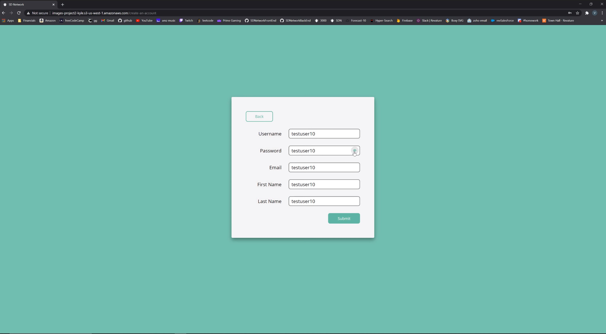
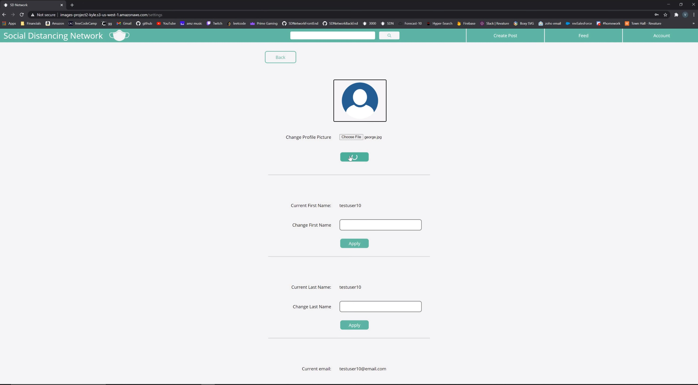
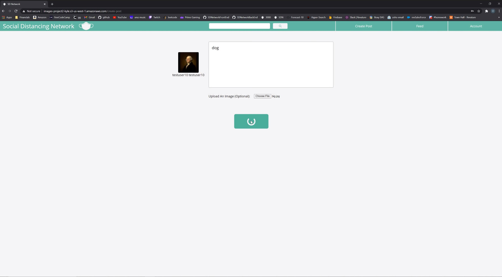
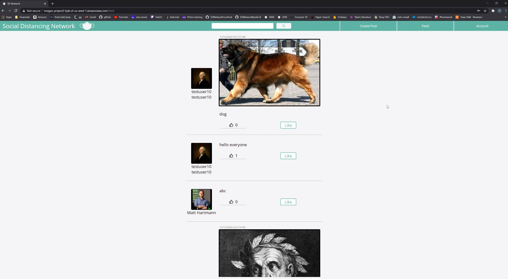

# SDNetworkFrontEnd

Youtube Video Demonstrating the Social Distancing Network: https://www.youtube.com/watch?v=TK4Ltgx0o2M&feature=youtu.be

The Social Distancing Network is a website which immitates the beginnings of Facebook. It allows users to create an account, log in, and view posts made by their network. Users may visit individual profiles (including their own), as well as the feed, which aggregates all posts made by the user's network. SD Network uses a Zen Green and Pastel White color palette, which gives the aesthetic of the website a calming and relaxing effect, much like the 'Blue Yonder' of Facebook. All buttons have spinners to indicate reactivity to user input, as well as hover and active color changes. All features highlight and dehighlight based on user input.

The Front End is a Typescript React App. It is structured in a granular way, with many components dual purposing in other areas of the website. For example, the "User Square" is used in the Friend's Box on a User's profile page, on the left side of a Post Component, indicating the author of the post, and on the create a new post page. Redux is used to store the global user object, as well as local storage. Route Guarding is in place, as well as a safe log-out which deletes all user data from local storage. 

### Creating A New Account

### Changing Profile Image On Settings Page

### Creating A New Post

### Taking A Look At The Feed

### Additional Features
In addition to the features depicted in the images above, we also had like/unlike functionality, as well as a number of likes per post. We developed search bar functionality in both the front and back ends. The search results page returns a maximum of 24 search results, with "More" and "Less" buttons to show more or fewer results. The settings page allows the user to change all but their username.
